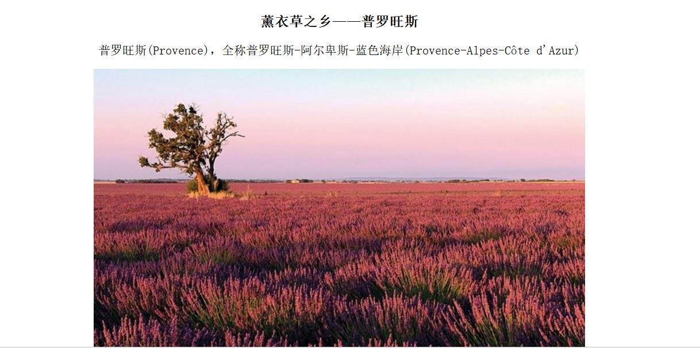
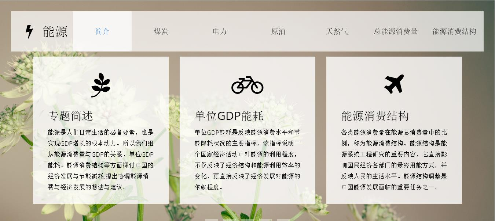

                

<b>个人网页——普罗旺斯（哔哩哔哩视频)</b>

这是第一次做个人网站，介绍法国薰衣草之乡——普罗旺斯(网页尝试插入图片和视频)
 <b>[逛一逛普罗旺斯>>](https://winniegjx2.github.io/GJX.github.io/)  

<b>M组期中专题网页——能源消耗量与GDP</b>
   
- 专题简述:从能源消费量与GDP的关系、单位GDP能耗、能源消费结构等方面探讨中国的经济发展与节能减耗,提出协调能源消费与经济发展的想法与建议。
<link rel="stylesheet" href="style.css" type="text/css">
<meta charset="UTF-8">
<b>[GO——瞧瞧网页吧](https://wanlihon.github.io/m/)

<b>wcy logo</b>

使用iframe标签插入SVG，做了以下调整：
1、将整个图形顺时针旋转160°  &nbsp&nbsp2、5秒钟动画从绿色背景变化为换黄色背景，动画结束，背景变成透明 &nbsp&nbsp3、5秒钟10px的盒阴影渐变效果
- 优化缩减百分比：原档案为43.2k，优化后为28.8k，优化缩减百分比为(43.2-28.8)/43.2=33.3%
<link rel="stylesheet" href="style.css" type="text/css"><meta charset="UTF-8">
[看看我的WCY logo动画>>](http://note.youdao.com/)  
   
